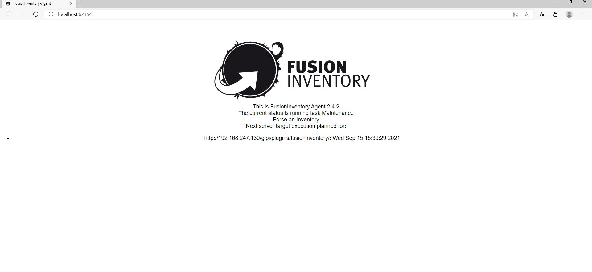
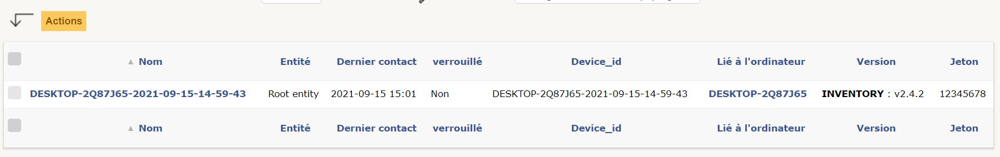

# Mise en place d'un poste client Windows 10 et remonter dans l'inventaire

Pour cette étape j'ai choisis d'installer un nouvelle VM avec un ISO Windows, toujours sur VM Ware Workstation, car je n'avais pas envie de le faire directement sur mon PC en cas de problème. De plus, cette VM me servira dans le futur. 

J'ai donc installé cette VM plus particulièrement pour installer **Fusion Inventory Agent** qui est un logiciel à installer sur les postes de notre parc informatique, il sert en quelques sortes à les "référencer". 

## Installation de Fusion Inventory Agent

Pour cette installation qui est plutôt simple j'ai suivi cette partie d'un tuto : https://openclassrooms.com/fr/courses/1730516-gerez-votre-parc-informatique-avec-glpi/5994176-installez-le-plugin-et-l-agent-fusioninventory#/id/r-6150440

La seule partie "délicate" de cette installation est au moment du choix de l'adresse d'envoi des résultats de l'inventaire, j'ai du simplement faire attention a l'adresse qu'il fallait rentrer, la mienne est celle la : http://192.168.247.130/glpi/plugins/fusioninventory

Une fois celle-ci rentré -> Installer et le téléchargement est finis. 

On va voir si celle ci a bien marché. 

Pour le savoir il suffisait de taper cette adresse dans le moteur de recherche : http://localhost:62354 

Si cette page se chargeait : 

Tout est ok. 

Pour que mon ordinateur soit compté dans l'inventaire Fusion Inventory, j'ai simplement cliquer sur **Force an Inventory** 

Ensuite pour vérifier que mon ordinateur avait bien été pris en compte je me suis rendu sur l'interface GLPI, puis **Administration** -> **FusionInventory** et **Général** -> **Gestion des agents**. 

On voit bien que mon PC est apparu donc tout a bien fonctionné. 

*** 

[Retour Sommaire](sommaire.md)  
Précédent : [Ajout de Fusion Inventory](fusioninventory.md), Suivant : [Sauvegarde GPLI](sauvegarde.md)