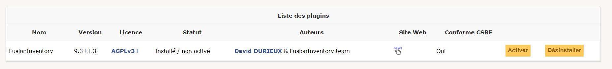

# Ajout de Fusion Inventory 

## Qu'est ce que Fusion Inventory ? 

FusionInventory est un logiciel servant à l'inventaire et la maintenance d'un parc informatique à l'aide d'autres logiciels de ce type tels que GLPI ou OCS Inventory. ... le déploiement de logiciels ; la découverte du matériel réseau connecté (utilisant Netbios, Nmap et SNMP).

***

## Installation et configuration Fusion Inventory 

Tout d'abord, j'ai commencé par mettre à jour le système : 

```
apt-get update && apt-get upgrade
```

Ensuite on retourne dans le repertoire source **usr/src** puis on va télécharger le plugin Fusion Inventory :

```
cd /usr/src

wget https://github.com/fusioninventory/fusioninventory-for-glpi/archive/glpi9.3+1.3.tar.gz

tar -zxvf glpi9.3+1.3.tar.gz -C /var/www/html/glpi/plugins 

```
Dans cette étape il fallait bien veiller à installer la bonne version de Fusion Inventory celle qui correspondait à la bonne version de GLPI, dans mon cas j'ai bien pris la version en 9.3 comme celle que j'ai pris pour GLPI.

Il fallait ensuite attribuer les droits d'accès au serveur web :

```
chown -R www-data /var/www/html/glpi/plugins
```

Puis il fallait préparer la compatibilité du répertoire pour le voir sur le site web : 

```
cd /var/www/html/glpi/plugins
mv fusioninventory-for-glpi-glpi9.3-1.3/ fusioninventory/
```

## Installation sur l'interface web 

Une fois sur l'interface GLPI, il faut se connecter à l'interface en mode super administrateur. (sur le compte GLPI)

Une fois connecté il faut se rendre dans **Configuration -> Plugins**

Si on a tout bien fait cette fenêtre va apparaitre : 



Puis on continue avec **Activer** -> **Installer** 

## Configuration du plugin 

Administration -> Fusion Inventory 

Par défaut cette version peut fonctionner sans lui apporter de modifications mails j'ai quand même régler les problèmes de crontab. 
On voit sur la page web un message d'alerte du a une absence de **cron.php**

Pour résoudre cela il suffit de passer en superutilisateur et rentrer les commandes suivantes : 

```
crontab -u www-data -e
```

Ensuite un choix va se mettre entre 1 et 2, j'ai choisis 1 et un fichier va s'ouvrir et j'ai rajouté cette ligne a la fin du fichier 

```
/1 * * * * /usr/bin/php5 /var/www/html/glpi/front/cron.php &>/dev/null

````

Puis il fallait finir par relancer **cron**

```
/etc/init.d/cron restart
```

Après ça, retour sur la page web puis Configurations -> Actions Automatiques puis chercher la tâche TaskScheduler (en page 2)
Une fois trouvé, cliquer sur **éxecuter** quand on retourne sur Administration -> Fusion Inventory, le message d'erreur que l'on avait avant a disparu. 

Fusion Inventory est bien installé.

***
[Retour Sommaire](sommaire.md) <br>
Précédent : [Mise en place d'un GLPI et configuration](glpi.md), Suivant : [Mise en place d'un poste client Windows 10 et remonter dans l'inventaire](client.md)