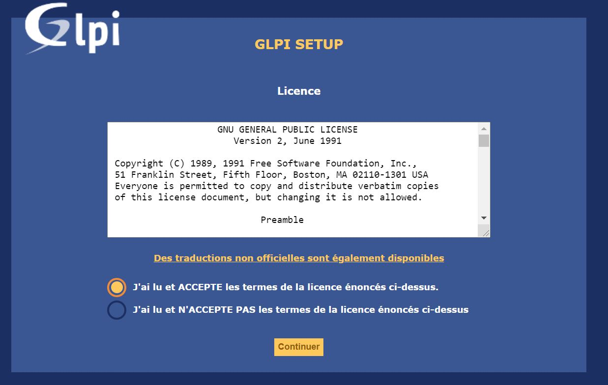
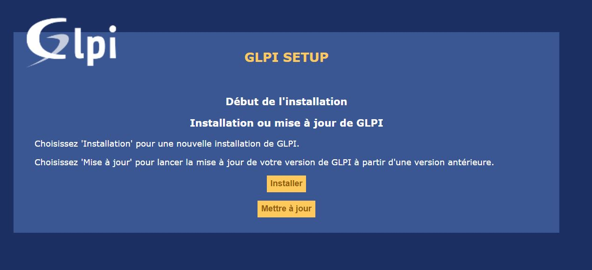
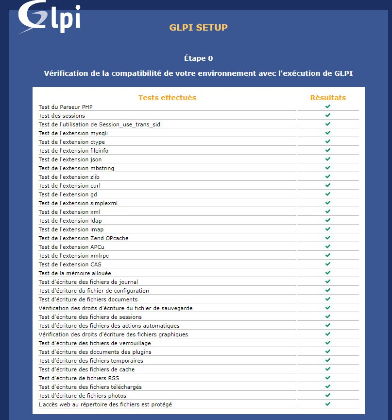
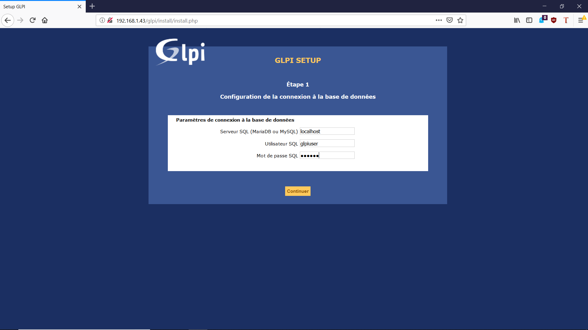
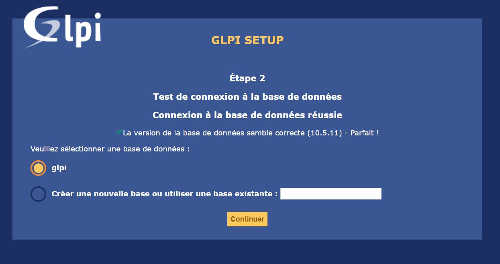
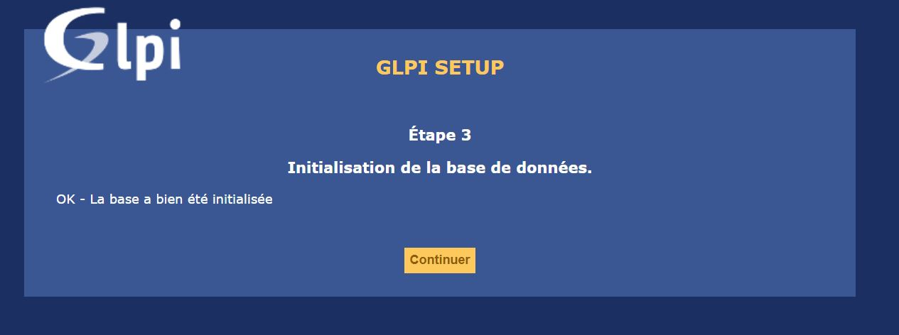
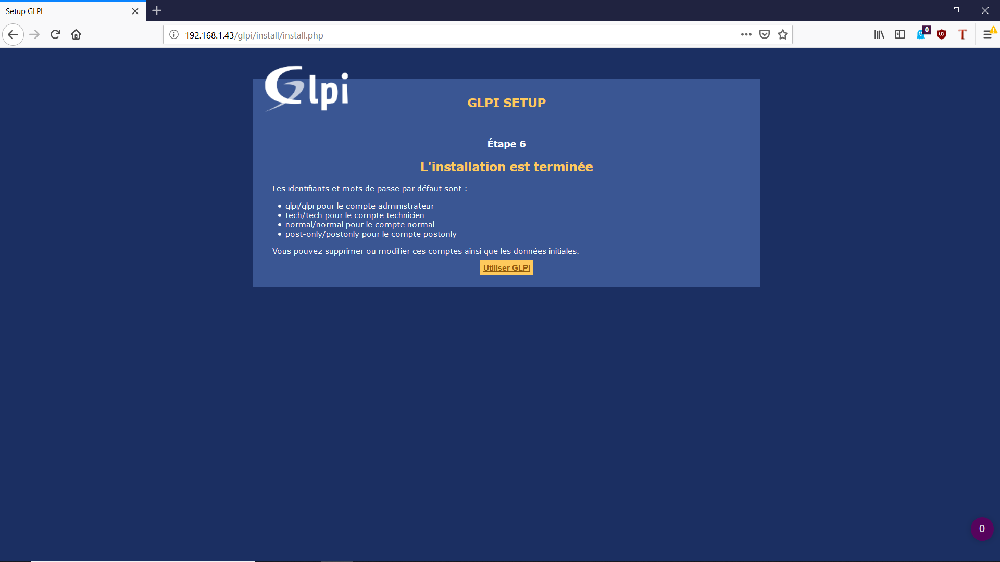
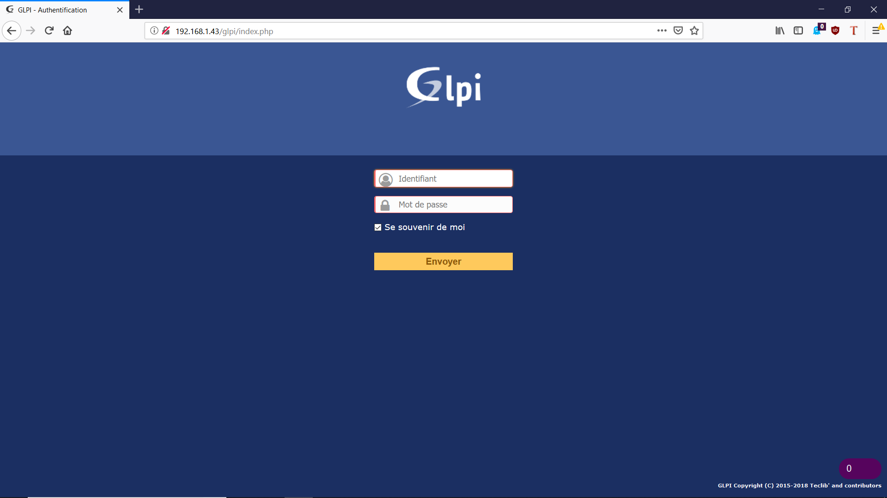

# Mise en place GLPI et configuration

Nous devions donc installer un serveur GLPI mais qu'est ce qu'un serveur GLPI ? 

    GLPI (Gestionnaire Libre de Parc Informatique) est un logiciel libre de gestion des services informatiques (ITSM) et de gestion des services d'assistance (issue tracking system et ServiceDesk).

L'installation de GLPI se passe en plusieurs étapes : 

- La préparation de notre machine à recevoir GLPI
- L'installation en lignes de commande 
- La configuration via l'interface web 


## Préparer notre machine à recevoir GLPI

Tout d'abord nous devions installer et configurer MySQL en ligne de commande, car GLPI a besoin d’un système de base de données pour stocker toute sa configuration.

- Installer : 

```
sudo apt update && sudo apt upgrade
sudo apt install mysql-server mysql-client 
```

- Configuration : 

On va se rendre dans le "menu" mySQL avec : 

``` 
mysql -u root -p 
```

On va ensuite : 

- Créez une base de données nommée glpi
- Créez un compte utilisateur MySQL nommé glpi
- Donnez un contrôle total sur la base de données glpi à l’utilisateur glpi

```
mysql> CREATE DATABASE glpi CHARACTER SET UTF8 COLLATE UTF8_BIN;
CREATE USER 'glpi'@'%' IDENTIFIED BY 'glpi';
GRANT ALL PRIVILEGES ON glpi.* TO 'glpi'@'%';
FLUSH PRIVILEGES;
quit;
````

Après avoir installé mySQL, j'ai installé Apache2 car GLPI a besoin d'un serveur web prenant en charge PHP pour les pages web. 

J'ai mis a jour les paquets : 

````
apt-get update && apt-get upgrade
````

Puis installé Apache2 : 

```
apt-get install apache2 php libapache2-mod-php
```

J'ai continué avec l'installation de PHP : 

```
apt-get install php-imap php-ldap php-curl php-xmlrpc php-gd php-mysql php-cas
```

Pour finir, j'ai tout simplement redémarré les services : 

```
/etc/init.d/apache2 restart
/etc/init.d/mysql restart
```
***

## Installation en lignes de commande de GLPI

L'installation de GLPI est très rapide et se passe en deux temps, dans un premier il faut récupérer les paquets GLPI grâce à ces commandes : 

```
cd /usr/src/

wget https://github.com/glpi-project/glpi/releases/download/9.3.3/glpi-9.3.3.tgz

tar -xvzf glpi-9.3.3.tgz -C /var/www/html
```

Ici j'ai malheureusement installé une version antérieure de GLPI qui est la 9.3.3 alors qu'il en existe un 9.5.5, cela ne changera pas la suite de ce TP mais il aurait été mieux de prendre la dernière version, elle aurait permis de faire les dernières mises à jour plus facilement. 

Cette étape passée j'ai atribué les droits au serveur d'agir sur les fichiers : 

```
chown -R www-data /var/www/html/glpi/
```
***
## Configuration via l'interface web 

Après l'installation, il faut ouvrir un navigateur et taper dedans l'ip de ma machine virtuelle suivie de **/glpi**

Pour moi : http://192.168.247.130/glpi/

On arrivait ensuite sur cette page et la configuration peut commencer : 


On sélectionne donc la langue que l'on veut et on clique "OK".

Le menu suivant est les conditions générales d'utilisation de GLPI : 




On accepte et on continue. 

On arrive ensuite sur le début de l'installation 




On peut donc cliquer sur "Installer"


La page d'après est la liste des paquets et vérification de leur installation : 



Ici il faut vérifier que tout les paquets sont correctement installé. Pour ma part il m'en manquait deux, le **simplexml** et **mbstring**

Que j'ai donc du réinstaller avec les commandes : 

```
apt-get install -y php-simplexml
apt-get install php7.2-mbstring
```

Ensuite on peut continuer l'installation. 



On arrive sur cette page ou il suffit de se connecter avec les infos que l'on avait configurer. 

En l'occurrence : 

- Serveur SQL → localhost ;

- Utilisateur SQL → glpiuser ;

- mot de passe SQL → Le mot de passe que j'ai défini précédemment.

On passe ensuite à la sélection de la base de données ici **glpi**



Une fois que c'est sélectionné on clique sur continuer 



On finit avec l'étape 6 : Installation terminée ! 



Elle confirme l’installation de GLPI et vous donne les logins et mots de passe des comptes par défaut. 

On a ensuite accès a la page de connexion du serveur il suffit de se connecter pour rentrer dans le GLPI. 



On entrera donc sur cette page : 

(a ajouter)

***

Précédent : [Installation de la VM / Configuration des services réseaux ](TP1/installationVM.md) Suivant : Ajout de Fusion Inventory 