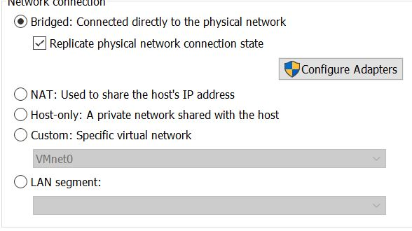
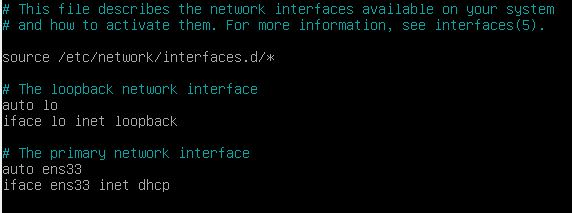

# Installation de la VM 

Pour commencer ce projet, nous devions tout d'abord mettre en place un environment de travail qui était une VM (machine virtuelle). 
***
## Qu'est ce qu'une machine virtuelle ? 

Une machine virtuelle ou VM est un environnement entièrement virtualisé qui fonctionne sur une machine physique. Elle exécute son propre système d’exploitation (OS) et bénéficie des mêmes équipement qu’une machine physique : CPU, mémoire RAM, disque dur et carte réseau. Plusieurs machines virtuelles avec des OS différents peuvent coexister sur le même serveur physique : Linux, MacOS, Windows…

***

Pour ce TP, j'ai choisi de travailler avec le logiciel de VM **VM Ware Workstation**.

 

Pour cela, j'ai du installer et configurer un espace de travail Linux avec une image ISO **Debian 11.0**. 
***
## Qu'est ce qu'un ISO 

Un fichier ISO, pour "International Organization for Standardization", est un fichiers "image" d'un disque optique (CD, DVD, blu-ray, etc.).
Il reprend l'ensemble des secteurs de données présents sur le disque, son contenu est strictement identique à celui présent sur le disque (dossiers, fichiers, arborescence).

***

## Pourquoi Debian 11.0 ? 

 

J'ai choisi d'utiliser Debian 11.0 comme système d'exploitation Linux plutôt que Ubuntu car celui-ci est beaucoup moins gourmand en ressources. 

J'ai choisi la version 11.0 de Debian car elle est la dernière version disponible, la plus à jour et celle ou il sera la plus simple de faire les mises à jour.  
***

## Configuration réseaux de la VM 

Pour la configuration réseaux, on a du tout d'abord régler notre VM dans les paramètres réseaux sur **Bridged** qui de base est sur **NAT**, on fait cela pour que notre VM soit considéré comme une machine à part qui est ça propre connexion. 

Malheureusement, après cette manipulation je n'avais toujours pas une adresse IP sur ma machine donc pas internet. Je ne pouvais donc pas faire de pont SSH. 

La solution que j'ai trouvé pour palier à ce problème, est de me remttre en **NAT** pour pouvoir mettre une adresse IP en "dur". Pour ça, on se rendait dans le dossier **etc/network** puis dans le fichier **interfaces** lui spécifier que la connexion est en DHCP. 
 

Après cela j'ai eu internet sur ma VM. Pour vérifier j'ai tout simplement ping l'adresse de Google **ping 8.8.8.8** et attendu une réponse du serveur. 

Le seul inconvénient de cette méthode est que je ne pouvais pas copier les commandes sur mon terminal CMD de mon PC grâce au pont SSH mais de tout installer via la VM. 

***

Précédent : [Objectifs du TP](objectifs.md) Suivant : [Mise en place d'un GLPI et configuration](glpi.md)

